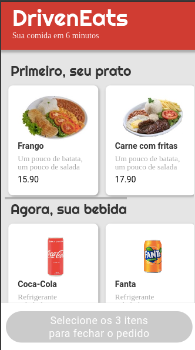
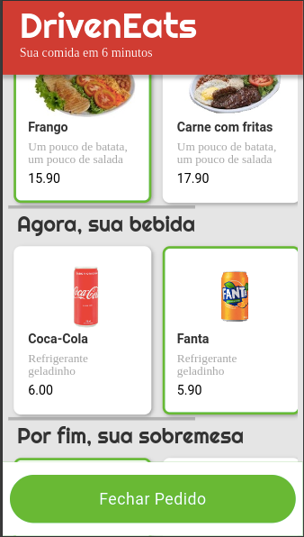
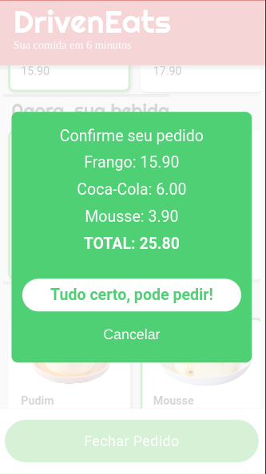

# Projeto DrivenEats

<h4 align="center"> 
	🚧 DrivenEats 🚧
</h4>

<!-- 	 -->
	

## 💻 Sobre o projeto

📄 Feito com HTML CSS e JavaScript explorando a manipulação do DOM. Projeto só possui visualização mobile.

---

## 🎨 Layout

### Mobile

  
  
  

